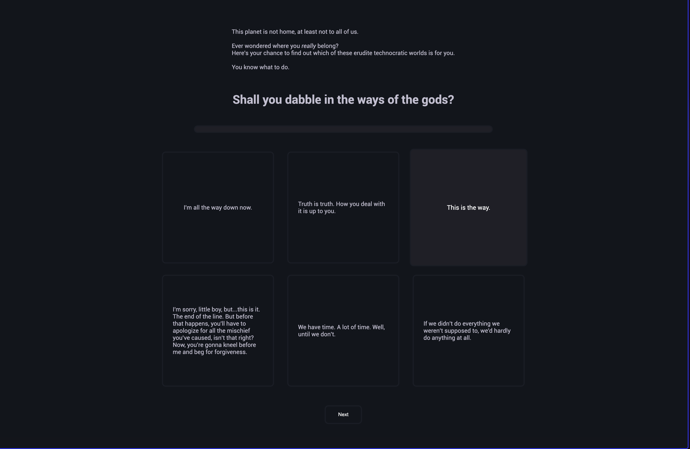
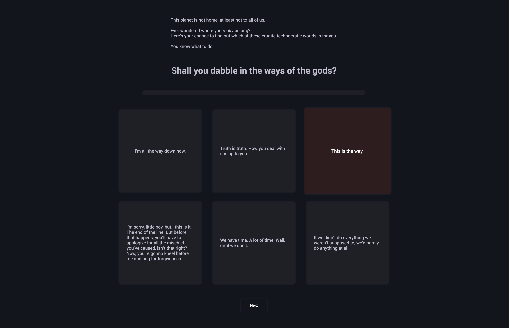
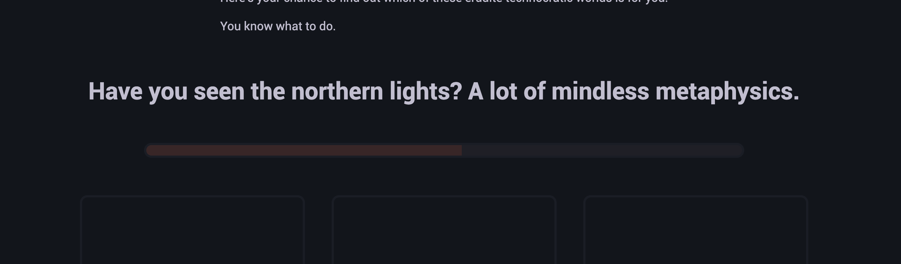
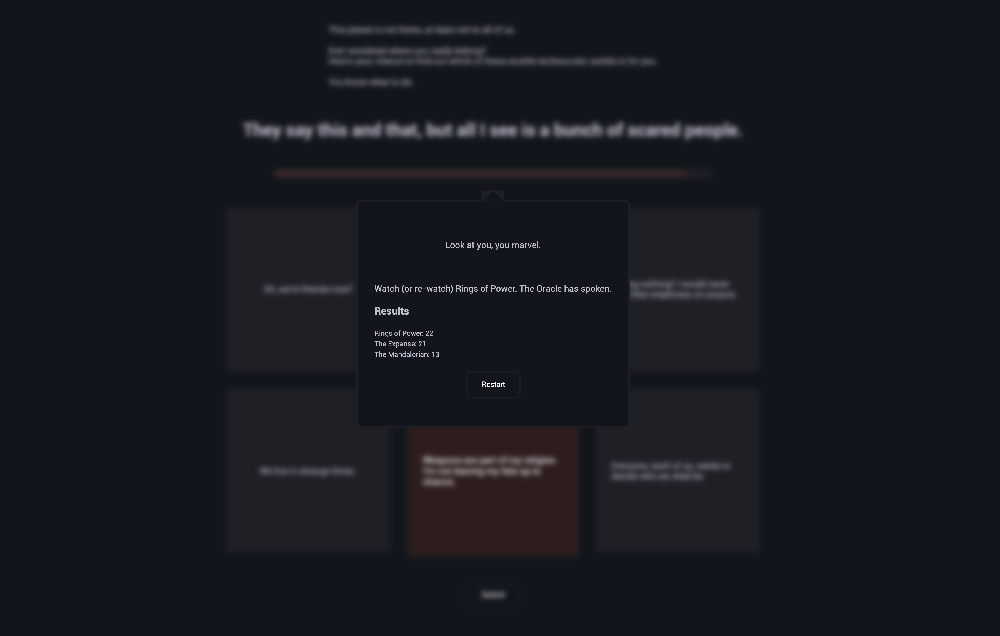

# Title

*Amittai, BuzzFeed Quiz*

> **Note**
>
> I got into the class late (end of week 2), and the prof said he would
> give me time to catch up with the assignments that had alredy
> happened.
> Consequently, I submitted this assignment a day late.

This program simulates a BuzzFeed quiz to recommend which dystopian world
is ideal for the user.

[deployed url](https://quizzical-8tlk.onrender.com/)

## What Worked Well

Most of the Javascript stuff was straightforward.
CSS was a bit tricky especially re. trying to avoid dead code.

## What Didn't

Nothing really.  

## Extra Credit

I did both the CSS focus and the Javascript focus.

### On the CSS Side

- On the CSS side, I added animations/transitions for the
  different states (hover, selected, etc.)
- I also added an animated progress-bar that shows one's progress in the quiz.
- I also added a "reset" button and a semi-transparent overlay for the
  "quiz complete" message that closes the message when clicked,
  thus simulating the "clicking outside the modal to dismiss it" behavior.
- I also made the sire responsive to different screen sizes.

### On the Javascript Side

- I implemented the described API in the assignment and used Javascript
  to parse JSON and populate the DOM.

- I also tried weighting the prompts differently based on how "relevant"
  I found each to be (how "representative" it was of the movie).
  Each prompt has a `weight` property and whoever wins the round
  takes the score (higher than or lower than average).

## Screenshots

### Hover State

### Selected State

### Progress Bar

### Quiz Complete

